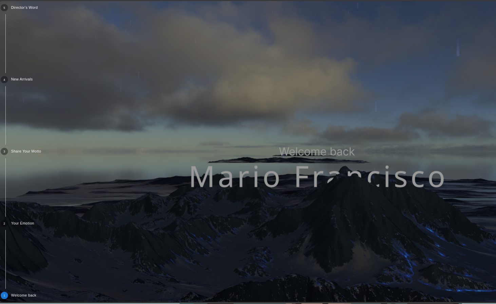

# Immersive scroll



## Overview

immersive scroll is an innovative web project designed to welcome users into a captivating 3D environment. Utilizing Three.js and react.js for rendering stunning 3D visuals, it combines the power of immersive graphics with interactive scrolling or timeline navigation to create a seamless and engaging user experience.

## Features

- **Immersive 3D Environment:** Dive into a visually rich and interactive 3D world, crafted with precision using Three.js.
- **Interactive Scrolling:** Navigate through the environment using smooth scrolling or an intuitive timeline library, enhancing user engagement.
- **Dynamic Weather Effects:** Experience realistic weather conditions such as sunny and rainy effects. Configure the intensity of the sun or rain to match different moods and settings.
- **User-Friendly Interface:** A welcoming and accessible interface that invites users to explore and interact with the 3D space.
- **Cross-Platform Compatibility:** Optimized for performance across various devices and screen sizes, ensuring a consistent experience for all users.
- **Customizable Elements:** Easily adaptable for different themes and purposes, from educational tools to immersive storytelling and beyond.

## Welcome Flow Steps

1. **Welcome and Introduction**

   - Start with a visually appealing welcome screen featuring a brief animation or transition.
   - Display a warm, welcoming message such as "Welcome to Immersive Scroll!"

2. **Emotion Check-In**

   - Ask the user how they are feeling today. For example, "How are you feeling today?"
   - Provide a selection of emotions (e.g., Happy, Sad, Excited, Anxious) as clickable buttons or icons.
   - Acknowledge their selection with a friendly message, e.g., "Thank you for sharing. Let's make your experience enjoyable!"

3. **Share Your Motto**

   - Encourage users to share their personal motto or a quote they find inspiring. For example, "What is your motto or an inspiring quote for today?"
   - Provide a text input field for users to type their motto.
   - Display a confirmation message, e.g., "Great motto! Let's keep it in mind as we explore."

4. **Highlight of the Day**

   - Introduce a feature that highlights the "User of the Day" or "CTO World" if applicable. This could be an inspirational figure or a daily featured user.

5. **Begin Your 3D Journey**
   - Smoothly transition from the introductory steps to the main 3D immersive experience.
   - Provide brief guidance on how to navigate the 3D environment, such as "Use the scroll or timeline to explore."

## Getting Started

To get started with Immersive scroll, follow these steps:

1. **Clone the Repository**

   ```bash
   git clone https://github.com/happymalyo/3d-immersive-scroll
   cd 3d-immersive-scroll

   ```

2. **Intall Dependencies**
   ```bash
   npm install --legacy-peer-deps
   ```

Enjoy the Demo [here](https://3d-immersive-scroll.vercel.app/) ;) 🌟✨
